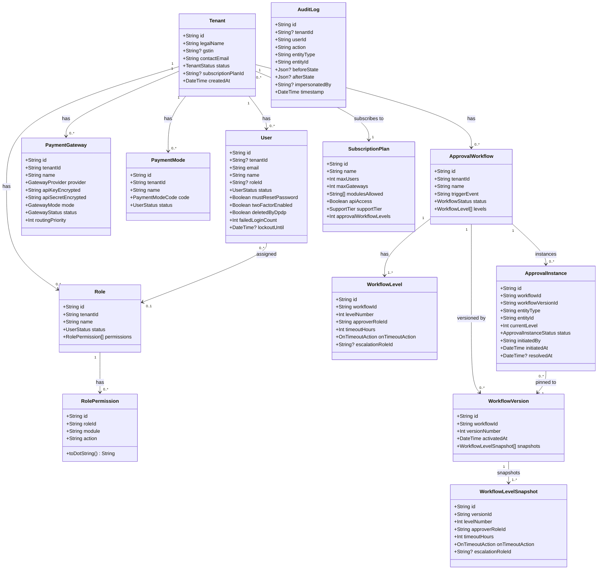
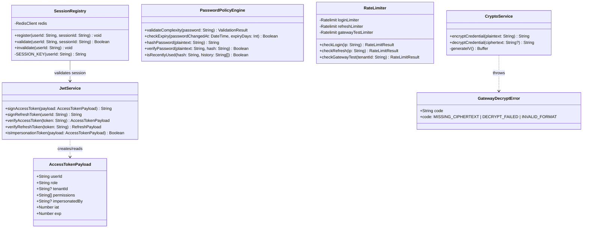
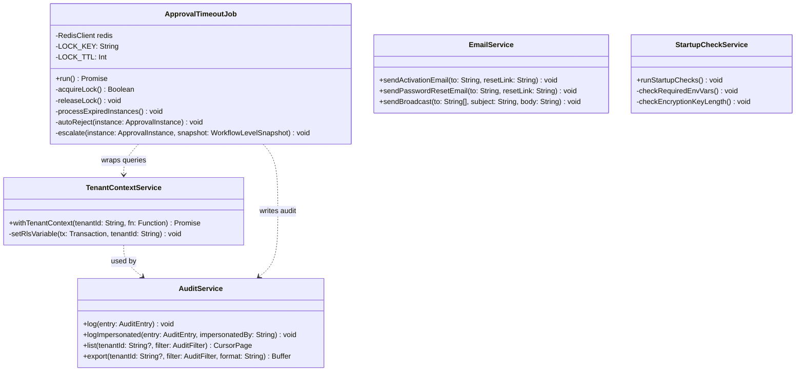
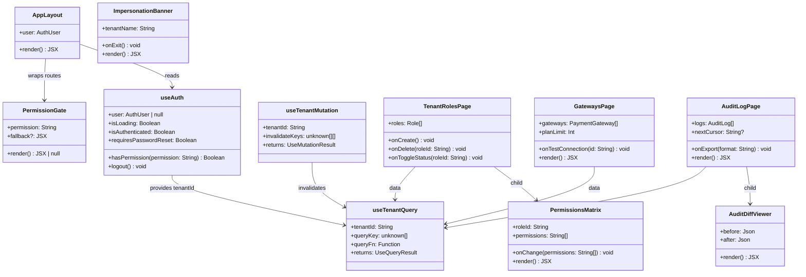
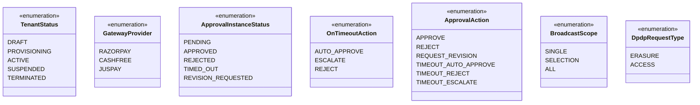

# Class Diagrams
## Matrix Emart Admin Platform — Phase 1

---

## 1. Domain Model

---

## 2. Auth & Security Layer

---

## 3. API Layer (Route Handlers)

```mermaid
classDiagram
    class AuthHandler {
        +POST_login(req: Request) Response
        +POST_refresh(req: Request) Response
        +POST_logout(req: Request) Response
        +POST_passwordResetRequest(req: Request) Response
        +POST_passwordReset(req: Request) Response
        +POST_passwordChange(req: Request) Response
    }

    class TenantRolesHandler {
        +GET_list(tenantId: String) Response
        +POST_create(tenantId: String, body: CreateRoleDto) Response
        +GET_one(tenantId: String, roleId: String) Response
        +PUT_update(tenantId: String, roleId: String, body: UpdateRoleDto) Response
        +DELETE_one(tenantId: String, roleId: String) Response
        +PUT_permissions(tenantId: String, roleId: String, permissions: String[]) Response
    }

    class GatewayHandler {
        +GET_list(tenantId: String) Response
        +POST_create(tenantId: String, body: CreateGatewayDto) Response
        +GET_one(tenantId: String, id: String) Response
        +PUT_update(tenantId: String, id: String, body: UpdateGatewayDto) Response
        +DELETE_one(tenantId: String, id: String) Response
        +POST_testConnection(tenantId: String, id: String) Response
        +PATCH_status(tenantId: String, id: String, status: String) Response
    }

    class ApprovalsHandler {
        +GET_workflows(tenantId: String) Response
        +POST_createWorkflow(tenantId: String, body: CreateWorkflowDto) Response
        +PUT_updateWorkflow(tenantId: String, id: String, body: UpdateWorkflowDto) Response
        +DELETE_workflow(tenantId: String, id: String) Response
        +GET_instances(tenantId: String, filter: InstanceFilter) Response
        +POST_approve(tenantId: String, instanceId: String, notes: String) Response
        +POST_reject(tenantId: String, instanceId: String, notes: String) Response
    }

    class PlatformTenantsHandler {
        +GET_list(filter: TenantFilter) Response
        +POST_create(body: CreateTenantDto) Response
        +GET_one(tenantId: String) Response
        +PATCH_status(tenantId: String, status: TenantStatus) Response
        +POST_impersonate(tenantId: String) Response
    }

    class Middleware {
        +verifyJWT(req: Request) AccessTokenPayload
        +enforceRouteGuard(payload: AccessTokenPayload, path: String) void
        +injectHeaders(payload: AccessTokenPayload, req: Request) void
        +checkTenantIdNotNull(req: Request) void
    }

    Middleware --> AuthHandler : guards
    Middleware --> TenantRolesHandler : guards
    Middleware --> GatewayHandler : guards
    Middleware --> ApprovalsHandler : guards
    Middleware --> PlatformTenantsHandler : guards
```

---

## 4. Service Layer

---

## 5. Frontend — React Component Hierarchy

---

## 6. Enumerations

