# Entity-Relationship Diagram
## Matrix Emart Admin Platform — Phase 1

```mermaid
erDiagram
    %% ─── CORE ───────────────────────────────────────────────────────────────

    TENANT {
        string id PK
        string legalName
        string gstin
        string contactEmail
        string businessType
        string country
        TenantStatus status
        string subscriptionPlanId FK
        datetime createdAt
        datetime updatedAt
    }

    USER {
        string id PK
        string tenantId FK
        string email
        string name
        string roleId FK
        UserStatus status
        datetime lastLoginAt
        string passwordHash
        datetime passwordChangedAt
        int failedLoginCount
        datetime lockoutUntil
        boolean mustResetPassword
        boolean twoFactorEnabled
        string twoFactorSecret
        boolean deletedByDpdp
        datetime createdAt
        datetime updatedAt
    }

    ROLE {
        string id PK
        string tenantId FK
        string name
        UserStatus status
        datetime createdAt
        datetime updatedAt
    }

    ROLE_PERMISSION {
        string id PK
        string roleId FK
        string module
        string action
    }

    %% ─── PAYMENT ─────────────────────────────────────────────────────────────

    PAYMENT_GATEWAY {
        string id PK
        string tenantId FK
        string name
        GatewayProvider provider
        string apiKeyEncrypted
        string apiSecretEncrypted
        GatewayMode mode
        GatewayStatus status
        int routingPriority
        string logoUrl
        datetime createdAt
        datetime updatedAt
    }

    PAYMENT_MODE {
        string id PK
        string tenantId FK
        string name
        PaymentModeCode code
        UserStatus status
        datetime createdAt
        datetime updatedAt
    }

    PAYMENT_MODE_GATEWAY {
        string modeId FK
        string gatewayId FK
        int priorityOrder
    }

    %% ─── SETTINGS ────────────────────────────────────────────────────────────

    TENANT_GENERAL_SETTINGS {
        string id PK
        string tenantId FK
        string displayName
        string logoUrl
        string faviconUrl
        string seoTitle
        string seoDescription
        string supportEmail
        string phoneNumber
        string address
        datetime updatedAt
    }

    TENANT_SECURITY_SETTINGS {
        string id PK
        string tenantId FK
        int passwordExpiryDays
        int passwordMinLength
        int maxFailedAttempts
        int lockoutDurationMins
        boolean requireTwoFactor
        string[] ipWhitelist
        int sessionTimeoutHours
        datetime updatedAt
    }

    TENANT_TAX_SETTINGS {
        string id PK
        string tenantId FK
        string gstin
        string legalName
        string registeredAddress
        TaxType taxType
        string invoicePrefix
        int invoiceStartNumber
        string termsAndConditions
        string digitalSignatureUrl
        datetime updatedAt
    }

    %% ─── APPROVAL WORKFLOW ───────────────────────────────────────────────────

    APPROVAL_WORKFLOW {
        string id PK
        string tenantId FK
        string name
        string triggerEvent
        WorkflowStatus status
        datetime createdAt
        datetime updatedAt
    }

    WORKFLOW_LEVEL {
        string id PK
        string workflowId FK
        int levelNumber
        string approverRoleId FK
        int timeoutHours
        OnTimeoutAction onTimeoutAction
        string escalationRoleId FK
    }

    WORKFLOW_VERSION {
        string id PK
        string workflowId FK
        int versionNumber
        datetime activatedAt
        string activatedBy
    }

    WORKFLOW_LEVEL_SNAPSHOT {
        string id PK
        string versionId FK
        int levelNumber
        string approverRoleId
        int timeoutHours
        OnTimeoutAction onTimeoutAction
        string escalationRoleId
    }

    APPROVAL_INSTANCE {
        string id PK
        string workflowId FK
        string workflowVersionId FK
        string entityType
        string entityId
        int currentLevel
        ApprovalInstanceStatus status
        string initiatedBy FK
        datetime initiatedAt
        datetime resolvedAt
        string resolvedBy FK
    }

    APPROVAL_ACTION_RECORD {
        string id PK
        string instanceId FK
        int levelNumber
        string actorUserId FK
        ApprovalAction action
        string notes
        datetime timestamp
    }

    %% ─── AUDIT ───────────────────────────────────────────────────────────────

    AUDIT_LOG {
        string id PK
        string tenantId
        string userId FK
        string action
        string entityType
        string entityId
        json beforeState
        json afterState
        string ipAddress
        string impersonatedBy FK
        datetime timestamp
    }

    %% ─── SUBSCRIPTION & PLATFORM ─────────────────────────────────────────────

    SUBSCRIPTION_PLAN {
        string id PK
        string name
        PricingModel pricingModel
        BillingCycle billingCycle
        string currency
        UserStatus status
        int maxUsers
        int maxGateways
        string[] modulesAllowed
        boolean apiAccess
        SupportTier supportTier
        int approvalWorkflowLevels
        datetime createdAt
        datetime updatedAt
    }

    TENANT_PLAN_CHANGE {
        string id PK
        string tenantId FK
        string fromPlanId
        string toPlanId FK
        PlanChangeMode effectiveMode
        datetime effectiveAt
        string initiatedBy FK
        PlanChangeStatus status
        datetime createdAt
    }

    TENANT_FEATURE_FLAG {
        string id PK
        string tenantId FK
        string featureKey
        boolean enabled
        string overrideReason
        datetime expiresAt
        string setByUserId
        datetime createdAt
        datetime updatedAt
    }

    TENANT_FEATURE_FLAG_AUDIT {
        string id PK
        string flagId FK
        string tenantId
        string changedBy FK
        boolean oldValue
        boolean newValue
        string reason
        datetime changedAt
    }

    TENANT_METRIC_SNAPSHOT {
        string id PK
        string tenantId FK
        datetime snapshotDate
        int activeUsers30d
        int apiCalls30d
        float errorRate
        bigint storageBytesUsed
        datetime lastLoginAt
    }

    TENANT_BROADCAST {
        string id PK
        string sentByUserId FK
        BroadcastScope scope
        string[] targetTenantIds
        string subject
        string body
        BroadcastType broadcastType
        datetime sentAt
    }

    TENANT_BROADCAST_READ {
        string id PK
        string broadcastId FK
        string tenantId FK
        string readByUserId FK
        datetime readAt
    }

    %% ─── DPDP ────────────────────────────────────────────────────────────────

    DATA_SUBJECT_REQUEST {
        string id PK
        string tenantId FK
        string requesterEmail
        DpdpRequestType type
        DpdpRequestStatus status
        datetime createdAt
        datetime resolvedAt
    }

    PII_FIELD {
        string id PK
        string tableName
        string columnName
        string piiCategory
    }

    %% ─── API KEYS (stub) ─────────────────────────────────────────────────────

    API_KEY {
        string id PK
        string tenantId
        string name
        string keyHash
        datetime lastUsedAt
        datetime expiresAt
        string[] permissions
        ApiKeyStatus status
        string createdBy FK
        datetime createdAt
    }

    %% ─── RELATIONSHIPS ───────────────────────────────────────────────────────

    TENANT ||--o{ USER : "has"
    TENANT ||--o{ ROLE : "has"
    TENANT ||--o{ PAYMENT_GATEWAY : "has"
    TENANT ||--o{ PAYMENT_MODE : "has"
    TENANT ||--o{ APPROVAL_WORKFLOW : "has"
    TENANT ||--o{ AUDIT_LOG : "scoped to"
    TENANT ||--o{ TENANT_BROADCAST_READ : "receives"
    TENANT ||--o{ TENANT_METRIC_SNAPSHOT : "tracked by"
    TENANT ||--o{ TENANT_FEATURE_FLAG : "configured by"
    TENANT ||--o{ TENANT_PLAN_CHANGE : "has"
    TENANT ||--o{ DATA_SUBJECT_REQUEST : "has"
    TENANT ||--|| TENANT_GENERAL_SETTINGS : "has"
    TENANT ||--|| TENANT_SECURITY_SETTINGS : "has"
    TENANT ||--|| TENANT_TAX_SETTINGS : "has"
    TENANT }o--|| SUBSCRIPTION_PLAN : "assigned to"

    USER }o--|| TENANT : "belongs to"
    USER }o--o| ROLE : "assigned"
    ROLE ||--o{ ROLE_PERMISSION : "has"

    PAYMENT_MODE_GATEWAY }o--|| PAYMENT_MODE : "links"
    PAYMENT_MODE_GATEWAY }o--|| PAYMENT_GATEWAY : "links"

    APPROVAL_WORKFLOW ||--o{ WORKFLOW_LEVEL : "has"
    APPROVAL_WORKFLOW ||--o{ WORKFLOW_VERSION : "versioned by"
    APPROVAL_WORKFLOW ||--o{ APPROVAL_INSTANCE : "instances"
    WORKFLOW_LEVEL }o--|| ROLE : "approver role"
    WORKFLOW_LEVEL }o--o| ROLE : "escalation role"
    WORKFLOW_VERSION ||--o{ WORKFLOW_LEVEL_SNAPSHOT : "snapshots"
    WORKFLOW_VERSION ||--o{ APPROVAL_INSTANCE : "pinned by"
    APPROVAL_INSTANCE ||--o{ APPROVAL_ACTION_RECORD : "has"
    APPROVAL_INSTANCE }o--|| USER : "initiated by"
    APPROVAL_INSTANCE }o--o| USER : "resolved by"
    APPROVAL_ACTION_RECORD }o--|| USER : "actor"

    AUDIT_LOG }o--|| USER : "actor"
    AUDIT_LOG }o--o| USER : "impersonator"

    TENANT_BROADCAST }o--|| USER : "sent by"
    TENANT_BROADCAST ||--o{ TENANT_BROADCAST_READ : "read receipts"
    TENANT_BROADCAST_READ }o--|| USER : "read by"

    TENANT_FEATURE_FLAG ||--o{ TENANT_FEATURE_FLAG_AUDIT : "history"
    TENANT_FEATURE_FLAG_AUDIT }o--|| USER : "changed by"

    TENANT_PLAN_CHANGE }o--|| SUBSCRIPTION_PLAN : "to plan"
    TENANT_PLAN_CHANGE }o--|| USER : "initiated by"

    API_KEY }o--|| USER : "created by"
```

---

## Key Design Notes

| Decision | Rationale |
|----------|-----------|
| `WorkflowLevelSnapshot` separate from `WorkflowLevel` | Immutable copy pinned at submission (contract-at-signing model) |
| `ApprovalInstance.workflowVersionId` FK | Ensures in-flight approvals continue under original rules after workflow edits |
| `AuditLog.impersonatedBy` | Impersonated actions write two rows: one tenant-scoped, one platform-scoped |
| `PaymentGateway.apiKeyEncrypted` | AES-256-GCM; plaintext never stored or returned |
| `User.tenantId` nullable | `null` = platform admin (no tenant context) |
| `TenantBroadcastRead` junction | Read receipt per user per broadcast; supports unread count queries |
| `PiiField` registry table | Consumed by Phase 2 DPDP erasure tooling; no UI in Phase 1 |
