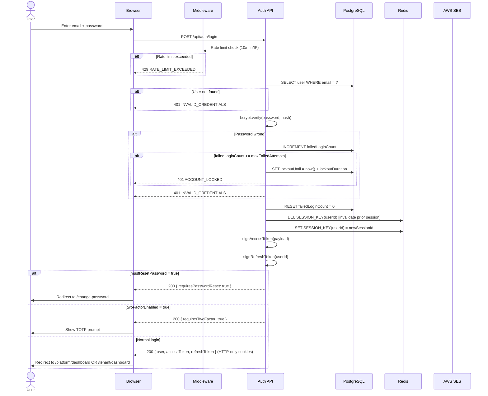
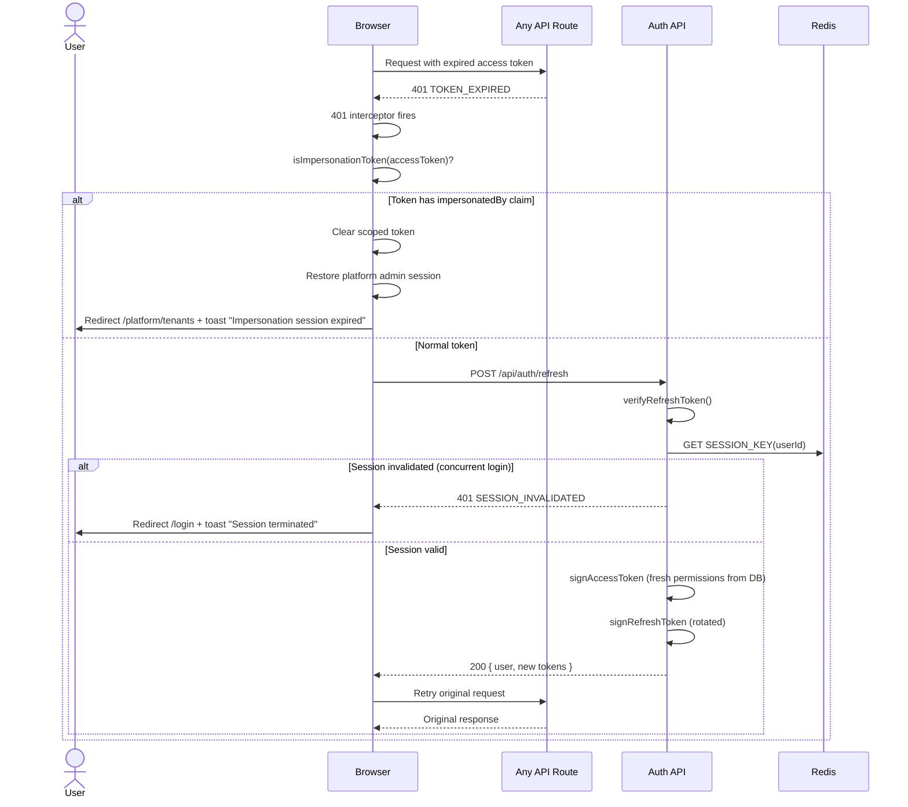
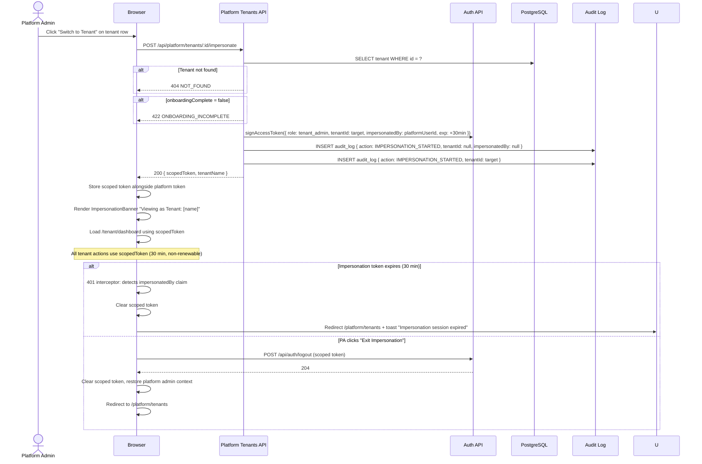
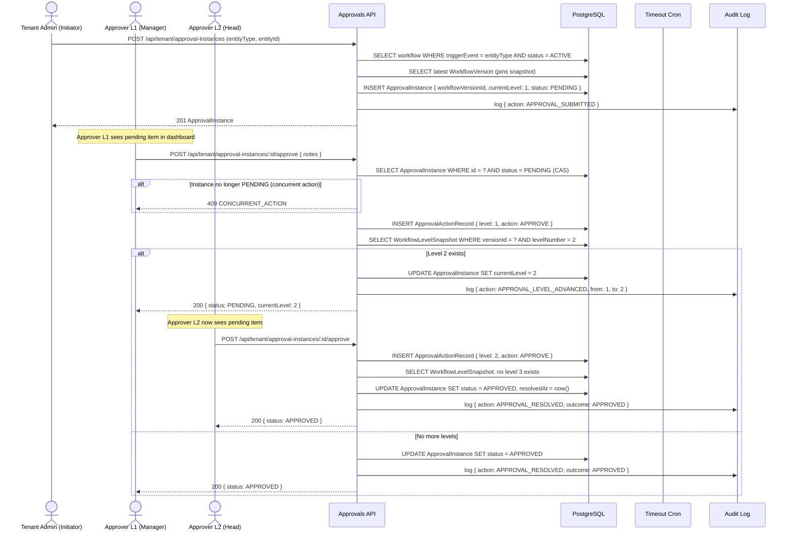
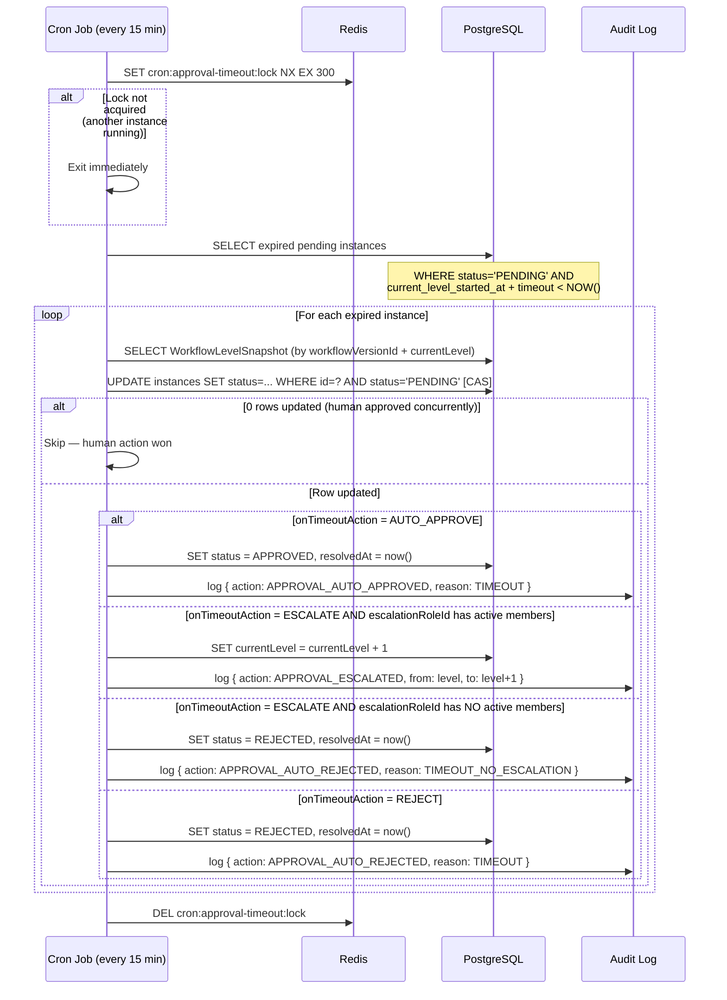
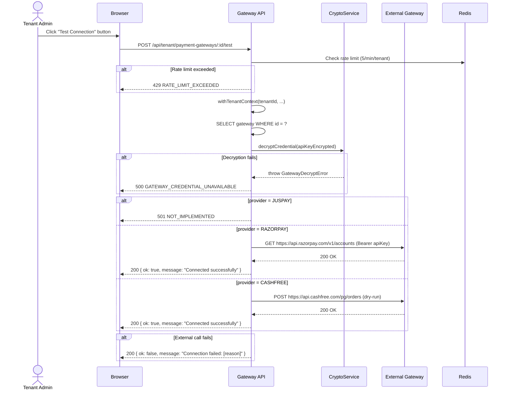
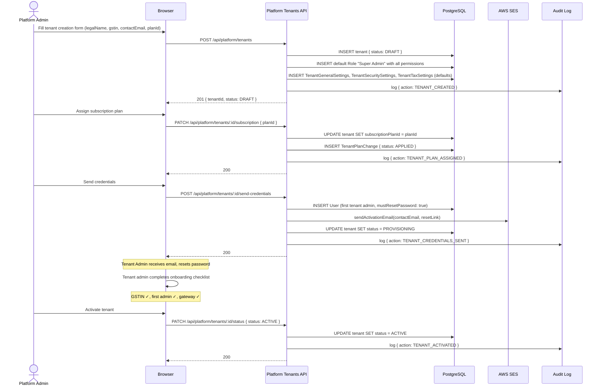
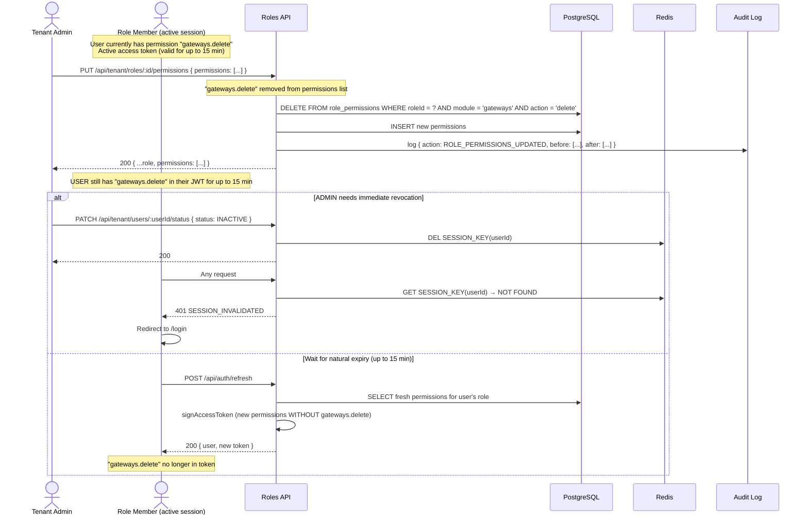

# Sequence Diagrams
## Matrix Emart Admin Platform — Phase 1

---

## 1. Login Flow (Standard)

---

## 2. Token Refresh + 401 Recovery

---

## 3. Platform Admin Impersonation Flow

---

## 4. Approval Workflow — Submission to Resolution

---

## 5. Approval Timeout Cron

---

## 6. Payment Gateway Test Connection

---

## 7. Tenant Onboarding (Platform Admin)

---

## 8. Role Permission Change + Enforcement Lag

